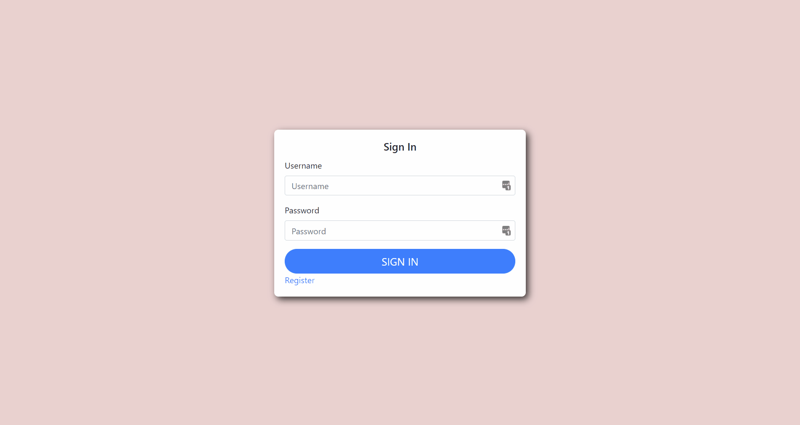
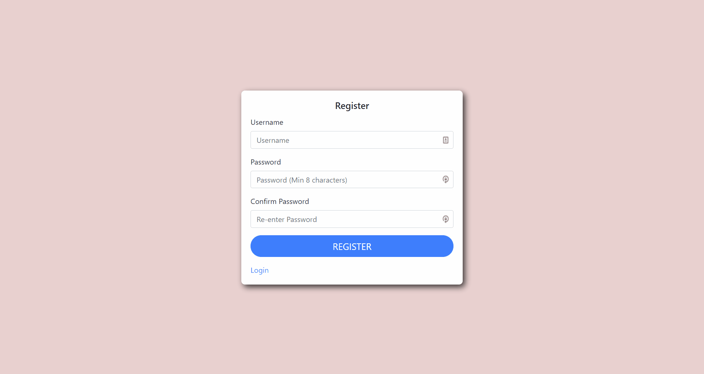
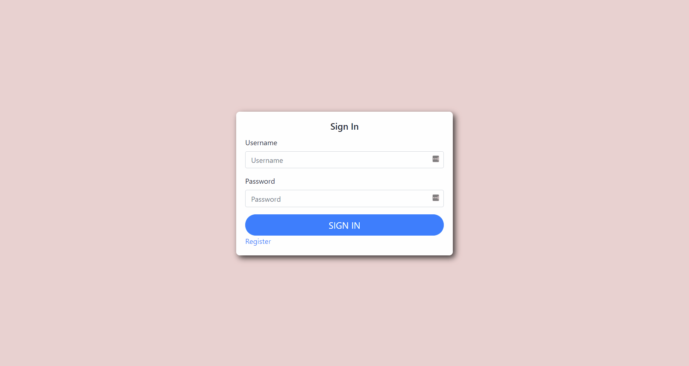
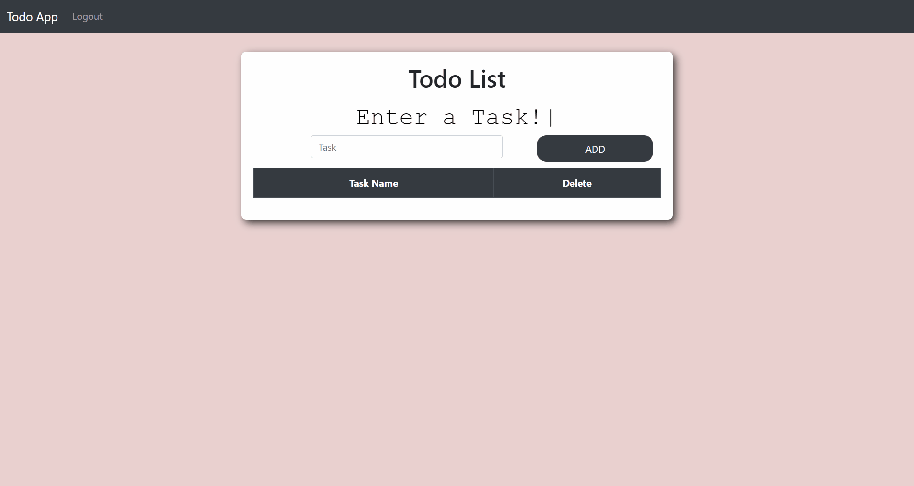

# MERN Stack Todo List

## Description
A simple todo list made using the MERN stack
- Secure login and registration through the use of JSON web tokens and bcrypt hashing
- Can create and delete tasks

Credit to [Devistry](https://www.youtube.com/playlist?list=PLJM1tXwlGdaf57oUx0rIqSW668Rpo_7oU) helping with only user authentication.

## Demo

### Login Demo

### Registration Demo

### Error Checking Demo

### Functionality Demo

### How To Deploy?
In the .env file located in the backend folder, please add your own MongoDB key which links to your own MongoDB database.
Please also create and add a secret key to the .env file used for password hashing by bcrypt. 
